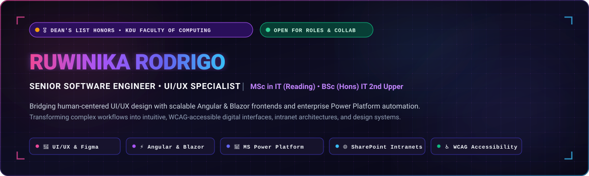
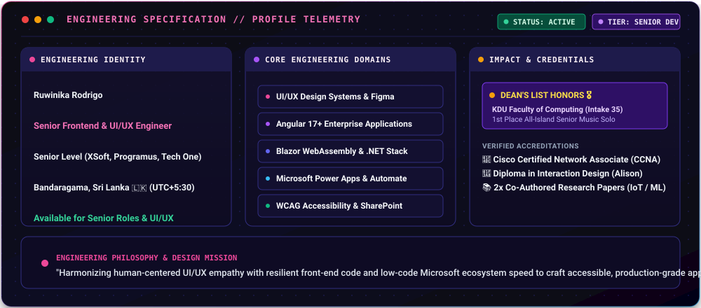
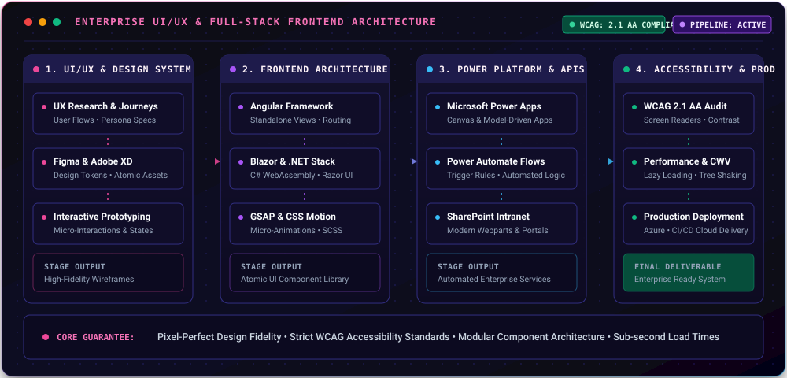
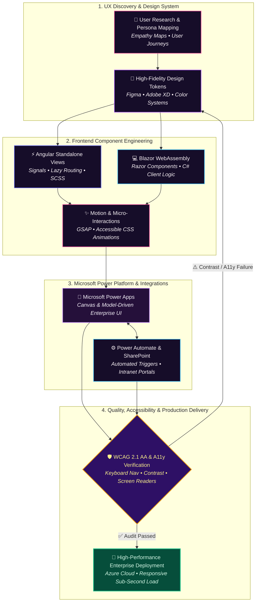
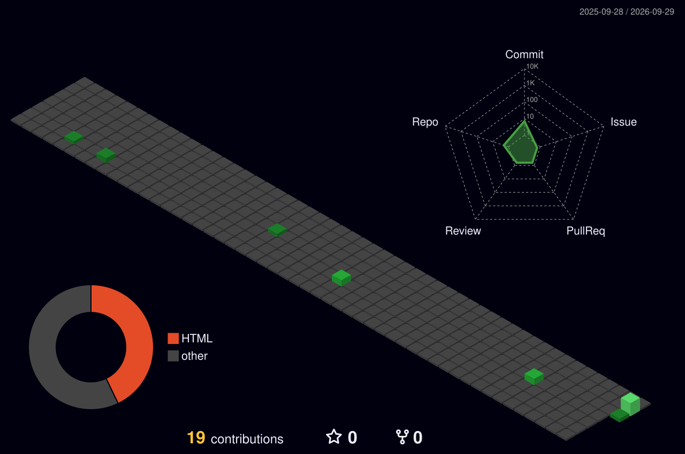

  <!-- Hero Header Vector Banner -->
  

    

  <!-- Dynamic Typing Subtitle -->
  

   

  <!-- Key Metrics Badges (Followers, Stars, Profile Views) -->
  

    
    
    
  

  <!-- Social & Network Badges -->
  

    
    
    
    
  

---

## 💻 Engineering Specification & Profile Telemetry

  

 

| 🌐 Parameter                   | ⚡ Operational Specification                                                                                 |
| :----------------------------- | :----------------------------------------------------------------------------------------------------------- |
| **Full Name**                  | **Paththini Hennedige Warnadeepthiya Kurukulasooriya Tharindu Ruwinika Rodrigo**                             |
| **Current Role**               | **Senior Software Engineer & UI/UX Specialist** at XSoftSolution Pvt Ltd                                     |
| **Experience Depth**           | **3+ Years** (Tech One Global ➔ Programus ➔ XSoftSolution)                                                   |
| **Academic Accolade**          | 🎖️ **Dean's List Award** — General Sir John Kotelawala Defence University *(Faculty of Computing, Intake 35)* |
| **Higher Education**           | 🎓 **Master in Information Technology (Reading)** — *University of Colombo School of Computing (UCSC)*       |
| **Undergraduate Degree**       | 🎓 **BSc (Hons) in Information Technology (2nd Class Upper Division)** — *KDU*                               |
| **Core Engineering Focus**     | **UI/UX Design Systems, Angular 17+, Blazor WebAssembly, MS Power Platform & SharePoint Intranets**          |
| **Location & Timezone**        | Bandaragama, Sri Lanka 🇱🇰 `(UTC+05:30)`                                                                       |
| **Collaboration Status**       | 🟢 **Open to Senior Frontend Engineering, UI/UX Architecture & Enterprise Automation Roles**                  |

---

## 🐍 Contribution Graph

<picture>
  <source media="(prefers-color-scheme: dark)" srcset="./assets/snake-dark.svg" />
  <source media="(prefers-color-scheme: light)" srcset="./assets/snake.svg" />
  
</picture>

---

## 🏆 Honors, Awards & Verified Accreditations

> ### 🎖️ Dean's List Honors — General Sir John Kotelawala Defence University
>
> Recognized on the prestigious **Dean's List** in the Faculty of Computing, Department of Information Technology (Intake 35) for outstanding academic distinction and engineering excellence.
>
> 
> 
> 

 

> ### 🥇 1st Place Champion — All Island Western Music and Dance Competition
>
> Awarded **1st Place (All-Island Winner)** in Senior Recorder Solo (2016). Demonstrates discipline, precision, pattern harmony, and creative artistry that deeply influences high-fidelity UI/UX and visual design systems.

 

> ### 🎓 Verified Professional Accreditations
>
> - 📜 **Cisco Certified Network Associate (CCNA-1)** — *Routing and Switching Essentials 1 (Cisco Networking Academy)*
> - 📜 **Cisco Certified Network Associate (CCNA-2)** — *Routing and Switching Essentials 2 (Cisco Networking Academy)*
> - 🛡️ **Introduction to Cybersecurity (CCNA)** — *Cisco Networking Academy*
> - 🎨 **Diploma in Interaction Design** — *Alison*
>
> 
> 

---

## 🚀 Featured Engineering Systems & Production Projects

| | System / Project | Description & Technologies | Status / Scope |
|:--:|---|---|:---:|
| 📈 | [**Employee Performance Evaluations & Career Progression System**](https://github.com/ruwinika97) | Automated enterprise performance evaluation matrix and intelligent career progression engine that delivers automated skill-gap analysis and training recommendations. `Blazor` `•` `.NET Core` `•` `Microsoft SharePoint` `•` `SQL` | `Master's Thesis (Ongoing)` |
| 🎵 | [**Emotion-Based Online Music Streaming Application**](https://github.com/ruwinika97) | Computer vision & ML-driven multimedia application analyzing real-time facial expressions to identify user mood and curate dynamic streaming playlists. `Android Studio` `•` `Java` `•` `Angular` `•` `TensorFlow ML` `•` `Firebase` | `BSc Final Year Research` |
| 🏅 | [**Paris Olympic 2024 Booking, Retail & Venue Management Platform**](https://github.com/ruwinika97) | Enterprise-grade Angular client application built with strict adherence to WCAG accessibility, fluid UI responsiveness, and micro-interaction states. `Angular Framework` `•` `TypeScript` `•` `Adobe XD` `•` `Figma` `•` `WCAG a11y` | `Production (Programus)` |
| 🏛️ | [**Online Leave Management System for KDU SC**](https://github.com/ruwinika97) | Web-based automated leave approval and telemetry tracking platform for Day Scholars at Southern Campus KDU. Served as **Group Leader**. `PHP` `•` `MySQL` `•` `HTML5` `•` `JavaScript` `•` `Bootstrap` | `KDU Production System` |
| 🗺️ | [**GIS Multi-Criteria Tea Nursery Spatial Engine**](https://github.com/ruwinika97) | Advanced spatial analytics and geographical multicriteria evaluation system identifying optimal environmental and topological zones in Galle District. `ArcGIS Software` `•` `VB Scripts` `•` `Spatial Analytics` | `Research GIS System` |
| 🌐 | [**Enterprise Modern Intranets & Power Automate Workflows**](https://github.com/ruwinika97) | Custom digital workspace portals, canvas & model-driven Power Apps, automated cross-department approval flows, and centralized document repositories. `Microsoft Power Apps` `•` `Power Automate` `•` `SharePoint Online` | `Enterprise Deployment` |

---

## 📚 Academic Publications & Research Contributions

> ### 📄 A Defence Against an Internet of Things (IoT) Attacks Based on Current Vulnerabilities
> **NIDA-ICADDA Thailand | 2020**  
> Comprehensive threat model and mitigation blueprint detailing contemporary IoT vulnerabilities, attack vectors, and protocol countermeasures for connected devices.  
> 

 

> ### 📄 An Overview of a Way to Deliver Online Music Streaming Services by Identifying the Neediness of Users' Music Listening
> **KDU Faculty of Computing Student Symposium | 2020**  
> Empirical study and architectural overview examining emotional state detection and user neediness mapping to deliver personalized, low-latency audio delivery.  
> 

---

## ⚡ Technical Arsenal & Core Stack

### 🎨 UI/UX Design, Prototyping & Design Systems

### 💻 Modern Frontend Engineering

### ⚡ Microsoft Power Platform & Enterprise Solutions

### 🛠️ Backend, Cloud & Databases

---

## 🧠 UI/UX Engineering & Design-System Architecture

  

 

  
<b>📊 Click to expand interactive Mermaid architecture pipeline</b>

   

- **Strict Design-to-Code Fidelity**: Ensuring zero visual degradation from Figma / Adobe XD prototypes to Angular and Blazor production code through unified design tokens.
- **Accessibility as a First-Class Citizen**: Architecting from day one with WCAG 2.1 AA standards, high contrast ratios, semantic HTML5 tags, and complete keyboard navigability.
- **Atomic Component Reusability**: Engineering decoupled, modular frontend components with clean boundaries for seamless maintenance across enterprise portals.
- **Enterprise Power Platform Synergies**: Streamlining corporate workflows by integrating custom frontend web applications with automated Microsoft Power Automate flows and SharePoint Online backends.

---

## 📊 GitHub Analytics & Live Activity

  
  

 

  
<b>3D Contribution Graph</b>

   
  

    
  

 

  
<b>📈 Click to view detailed language & profile telemetry</b>

   
  

    
      
    
    
  

 

### 💡 Daily Engineering & Design Wisdom

---

## 🌐 Let's Connect & Collaborate

  I am always open to discussing <b>Frontend Architecture, Modern UI/UX Design Systems, Enterprise Power Platform solutions</b>, or high-impact software engineering opportunities.

  
  
  
  

 

<!-- Footer Waving Capsule -->

  

  **Bandaragama, Sri Lanka** | Senior Software Engineer & UI/UX Specialist | Dean's List Awardee, KDU

  Engineered with precision, human-centered empathy &amp; design rigor • © <b>Ruwinika Rodrigo</b>

